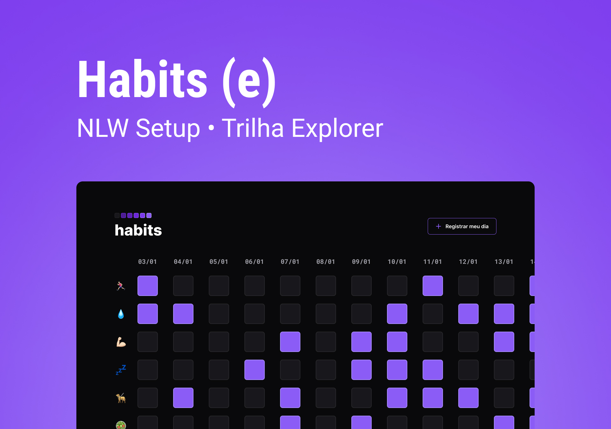

<h1 align="center"> Habits </h1>

NLW is a online free and exclusive event, promoted by Rocketseat to teach WEB technologies.  

  <a href="#-tecnologias">Technologies</a>&nbsp;&nbsp;&nbsp;|&nbsp;&nbsp;&nbsp;
  <a href="#-projeto">Project</a>&nbsp;&nbsp;&nbsp;|&nbsp;&nbsp;&nbsp;
  <a href="#-layout">Layout</a>&nbsp;&nbsp;&nbsp;|&nbsp;&nbsp;&nbsp;
  <a href="#memo-licença">License</a>

 

  

## 🚀 Technologies

This project was developed with the following technologies:
- HTML and CSS
- JavaScript
- Git and Github
- Figma

## 💻 Project

Habits is an app to help you track your habits.

- [Visit the project online](https://arthurfamaral95.github.io/NLWSetup/)

## 🔖 Layout

You can visit the prokect layout through  [THIS LINK](https://www.figma.com/community/file/1195327109778210238). It`s necessary to have a [Figma](https://figma.com) account to access it.

---

Done with ♥ by Rocketseat 👋: [Join our comunity!](https://discord.gg/rocketseat)